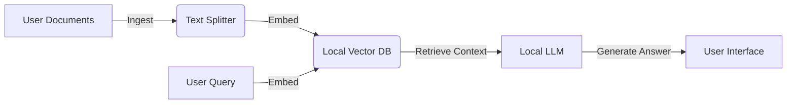

# Nexus

  

> **A Local-First RAG (Retrieval Augmented Generation) Engine for private, secure, and offline knowledge retrieval.**

## 📖 About Nexus
Nexus is designed to bridge the gap between your personal data and Large Language Models (LLMs) without sending a single byte to the cloud. By running the entire RAG pipeline locally, Nexus ensures:

1.  **Privacy:** Your documents (PDFs, Markdown, Text) never leave your machine.
2.  **Security:** No external API keys required; you own the model and the data.
3.  **Availability:** Works completely offline.

It ingests your local knowledge base, creates vector embeddings locally, and uses a local LLM to answer questions based on your data.

## ✨ Key Features
* **📂 Universal Ingestion:** Support for `.pdf`, `.md`, `.txt`, and `.docx` files.
* **🧠 Local Inference:** Built to integrate seamlessly with [Ollama](https://ollama.ai/) or local GGUF models.
* **⚡ High-Performance Retrieval:** Uses local vector stores (e.g., ChromaDB/FAISS) for millisecond-latency searches.
* **🔒 Zero-Data Leakage:** Designed for sensitive environments (legal, medical, or personal journaling).

---

## 🏗 Architecture

The system follows a standard RAG topology optimized for local execution:



## 🛠 Tech Stack

* **Core:** Python
* **LLM Runtime:** [Ollama / Llama.cpp]
* **Orchestration:** [LangChain / LlamaIndex]
* **Vector Database:** [ChromaDB / FAISS]
* **Embeddings:** [HuggingFace Embeddings (all-MiniLM-L6-v2)]

---

## 🚀 Getting Started

### Prerequisites

1. **Python 3.10+** installed.
2. **[Ollama](https://ollama.ai/)** (or your preferred local model runner) installed and running.
```bash
# Example: Pull the mistral model
ollama pull mistral

```


### Installation

1. **Clone the Repository**
```bash
git clone [https://github.com/loterrr/nexus-deploy.git](https://github.com/loterrr/nexus-deploy.git)
cd nexus-deploy

```


2. **Create a Virtual Environment**
```bash
python -m venv venv
source venv/bin/activate  # On Windows: venv\Scripts\activate

```


3. **Install Dependencies**
```bash
pip install -r requirements.txt

```


4. **Set Environment Variables**
Copy the example env file:
```bash
cp .env.example .env

```


*Update the `.env` file to point to your local model URL (usually `http://localhost:11434` for Ollama).*

---

## 💡 Usage

### 1. Ingest Documents

Load your knowledge base into the vector store. Place your files in the `/data` directory and run:

```bash
python nexus.py --ingest --dir ./data

```

### 2. Start the Chat Interface

Run the main application to start chatting with your data:

```bash
python nexus.py --chat

```

*Optional: If you have a web UI (e.g., Streamlit/Gradio)*

```bash
streamlit run app.py

```

---

## 🗺 Roadmap

* [x] Basic Document Ingestion (PDF/Text)
* [x] Local Vector Store integration
* [ ] **Web UI Implementation** (React/Next.js)
* [ ] Multi-Model Support (Switch between Mistral/Llama3)
* [ ] Chat History / Memory persistence

---

## 🤝 Contributing

Contributions are welcome! Please look at the `issues` tab for "good first issues".

1. Fork the Project
2. Create your Feature Branch (`git checkout -b feature/NewFeature`)
3. Commit your Changes (`git commit -m 'Add NewFeature'`)
4. Push to the Branch (`git push origin feature/NewFeature`)
5. Open a Pull Request

## 📄 License

Distributed under the MIT License. See `LICENSE` for more information.

```

### **Recommended Next Step**
Since this is a RAG system, the **"Tech Stack"** section is critical.

**Would you like me to generate a `requirements.txt` file** that matches this README (including libraries like `langchain`, `chromadb`, `pypdf`, etc.) so users can actually run the installation step?

```
